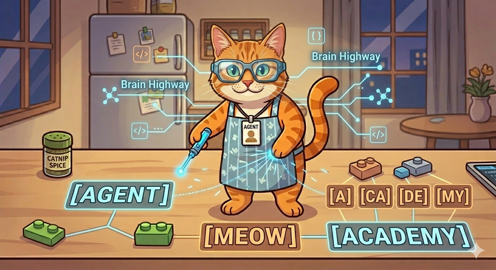

# 🐾 Project: Agent Meow’s AI Academy

  

> **"If you can’t explain it to an 8-year-old, you don't truly understand it."**

Welcome to **Agent Meow’s AI Academy**\! This is a collection of "Explain Like I'm Five" (ELI5) lessons designed to pull back the curtain on Artificial Intelligence. We take the "scary" math and "boring" code of things like NLP and Neural Networks and turn them into stories, games, and LEGO-style logic.

## 🐱 Meet Your Guide: Agent Meow

Agent Meow isn't just a cat; he’s an AI agent with a "Brain Made of Numbers." He’s here to show kids (and curious grownups) that AI isn't magic—it’s just a giant game of **Connect the Dots**. He’s got the whiskers for detail and the logic to back it up.

-----

## 📚 The Lesson Plan
 
We are breaking down the biggest ideas in tech into bite-sized "Cat Snacks":

| Topic | The "Kid" Version | Status |
| :--- | :--- | :--- |
| **Intro** | [Agent Meow's Secret Origin](lessons/001_agent_meow_origin.md) | 🟢 Active |
| **NLP** | [The Great Word Chopper](lessons/002_the_word_chopper.md) | 🟢 Active |
| **NLP** | [The Secret Map of Everything](lessons/003_the_secret_map.md) | 🟢 Active |
| **Classification** | [The Pattern Detective & The Mystery Box](/lessons/004_pattern_detective.md) | 🟢 Active |
| **Hierarchies** | [The "Lego Rule" (How parts become a whole)](/lessons/005_lego_rule.md) | 🟢 Active |
| **Logic & Math** | [The GPS Rule (Vector Math)](/lessons/006_the_gps_rule.md) | 🟢 Active |
| **Attention** | [The Brain Flashlight](/lessons/007_the_brain_flashlight.md) | 🟢 Active |
| **Neural Nets** | [The Highway vs. The Trail](/lessons/008_brain_highways.md) | 🟢 Active |
| **Generative AI** | [The Crystal Ball (Prediction)](/lessons/009_crystal_ball.md) | 🟢 Active |
| **Final Review** | The Agent's Graduation | Pending |

## 🛠 Project Structure

This repository uses a **Spec-Driven** approach. Every lesson starts as a "Fact Sheet" before being refactored into a blog post.

  * `/lessons`: Raw Markdown files for each AI concept.
  * `/assets`: Images, diagrams, and **Agent Meow** character art.
  * `/docs`: The GitHub Pages site configuration.

-----

## 🚀 How to Contribute

Got a complex tech concept that needs "de-jargonizing"?

1.  Open an **Issue** with the topic.
2.  We’ll run it through the **Agent Meow Logic Filter**.
3.  Once it’s simple enough for an 8-year-old, we ship it\!

-----

## 📝 Author’s Note

This project was born out of a belief that the future belongs to those who understand the tools they use. By teaching kids how neural pathways and language models work today, we’re helping them build the world of tomorrow.

**"Stay curious, keep sniffing out the truth, and never stop asking 'Why?'"** — *Agent Meow* 🐾
