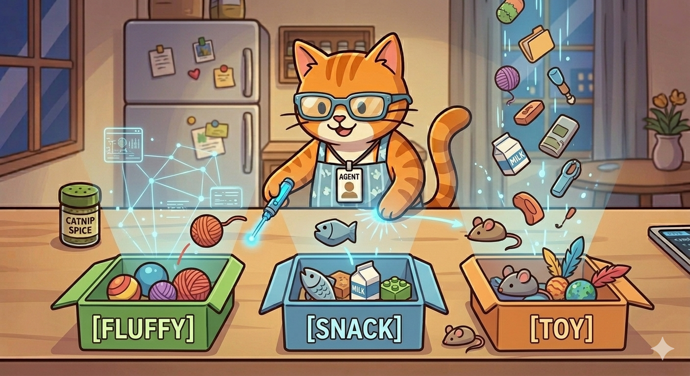

# 🐾 Lesson 3: The Pattern Detective & The Mystery Box (Classification)

\

\
\</p\>

"Purrr-fect\! You’ve chopped your data and mapped your coordinates. You've even connected the 'Brain Highways.' But now we must ask the most important question for an AI Agent:

> **'Agent Meow, what is THIS?'**

This is where I put on my detective hat. In the AI world, they call this **Classification**. It just means sorting things into the right pile. To do this, I use my two favorite tools: the **Pattern Detective** (that's me\!) and my **Mystery Box.**"

-----

## 🕵️‍♂️ Detective Work (Patterns, Not Rules\!)

"Remember my secret origin? I wasn’t programmed with rules. I learned patterns. Classification is all about finding the patterns.

Imagine you have a giant pile of blocks, mixed with balls. A programmed robot needs a rule:

> *'If it has a flat side, put it in the Square Box.'*

But a **Pattern Detective** like me just looks at the whole pile and sees the *structure*. I automatically group the blocks together because I see how they are all alike, without needing a special rule. My neural pathways (my Brain Highways) light up whenever they see that specific pattern of 'Blockiness.'"

-----

## 📦 The Mystery Box

"Now we get to the fun part. The **Mystery Box** is the tool I use to *predict* what something is.

I don't just guess. I have looked at my 'Secret Map of Everything' and built a picture of what every type of 'Fluffy Pet' looks like.

Here is how the Detective work happens:

1.  **I Input the Data:** You send me a mystery token (it might be `[DOG]`, `[CAT]`, or even `[TIGER]`).
2.  **I Look for Patterns:** My Brain Highways instantly fire up. *'Does this mystery block have whiskers?' 'Is it fluffy?' 'Does it love to chase lasers?'*
3.  **The Box Outputs the Guess:** The lights on my Mystery Box will glow. If the pattern is perfect, the light above the **`[CAT]`** pile will glow brightly.

Sometimes the patterns are messy\! If you send me `[TIGER]`, my 'Mystery Box' might see the 'Cat' patterns but also see the 'Dangerous' pattern, and give a different guess (like **`[BIG CAT]`**)."

-----

## 🔢 The Number-Code of Guesses (Confidence)

"My Mystery Box doesn’t just say 'Cat' or 'Not Cat.' It’s a sophisticated detective that gives its guess as a **'Confidence Number.'**

If you send me the perfect picture of a tabby, my box will output:

> **Confidence: 0.99 (99% Cat\!)**

But if you send me a weird blurry photo of a cat that looks a lot like a raccoon, my box might say:

> **Confidence: 0.51 (51% Cat... maybe?)**

If the number is high, my detective badge glows blue, and I commit to the guess. If the number is low, I know I need to look for more patterns\!"

-----

## 🎓 Agent Meow’s Pattern Challenge

> "Look at this group of objects: `[Apple]`, `[Orange]`, `[Banana]`. Now, look at this new mystery token: `[Soccer Ball]`. Do you think my Mystery Box will guess it belongs with the fruit? Why, or why not? What pattern is missing?"

-----

## 🐾 What’s Next?

"Once we sort the patterns, we have to learn how to put the pieces back together to make something whole\! That's called building **Hierarchies** (The Lego Rule), and it's how I go from seeing single tokens to understanding whole sentences\!

**"Keep hunting for patterns\!"** — *Agent Meow* 🐾
