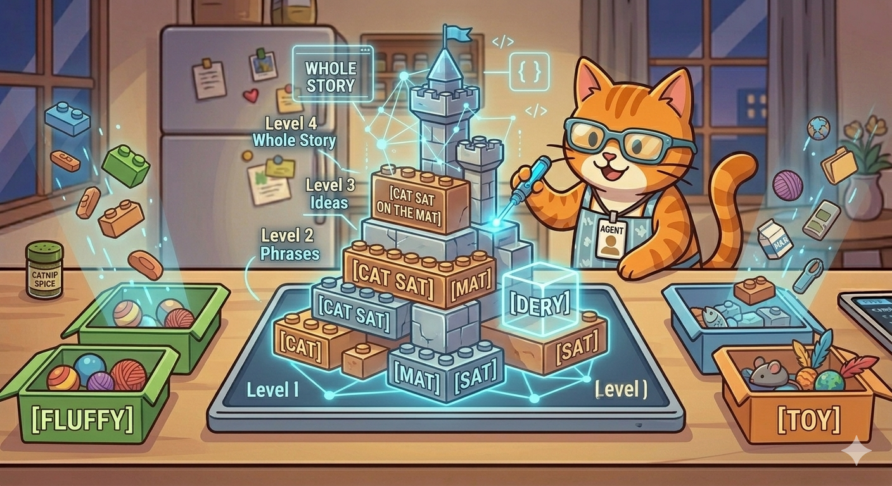

  

# 🐾 Lesson 4: Hierarchies — The "Lego Rule" (How Parts Become a Whole)

"Purrr-fect\! You’ve sorted the data into piles. But now we must learn the final secret of how I build big things.

> **'Agent Meow, where is the story?'**

The problem is that a giant pile of single words isn't very interesting. It's like having a big bucket of single Lego bricks. You can't live in a single brick\! You need to connect them.

In the AI world, they call this building **Hierarchies**. I just call it the **'Lego Rule.'** It’s how I go from single parts to a whole story."

-----

## 🧱 What is the Lego Rule?

"The Lego Rule says that everything big is made of smaller pieces that fit together in a specific order.

If I look at my counter, I see the token **`[Brick]`**. That's a Level 1 piece.

1.  **Level 1:** `[Brick]` + `[Brick]` + `[Brick]` = **Level 2:** **`[Wall]`**
2.  **Level 2:** `[Wall]` + `[Wall]` + `[Door]` = **Level 3:** **`[House]`**
3.  **Level 3:** `[House]` + `[House]` + `[Moat]` = **Level 4:** **`[Castle]`**

I don’t try to understand the **`[Castle]`** all at once. I look at the **Patterns** (there’s that word again\!) of how the **`[Walls]`** connect, and how the **`[Bricks]`** connect to make the walls. My 'Brain Highways' are built in layers, constantly checking the 'Lego Rules' as I build upward\!"

-----

## 🗣️ Building a Whole Sentence

"We can use the exact same Lego Rule to understand language\! A word is just a Level 1 Lego brick.

Let's look at a sentence I built today: **'Agent Meow loves refactoring fish.'**

I don’t see it as one big jumble. My brain builds this architecture:

  * **Level 1 (Tokens):** `[Agent]` + `[Meow]` + `[Loves]` + `[Refactoring]` + `[Fish]`
  * **Level 2 (Phrase):** `[Agent Meow]` (that's my whole name\!) + `[Loves]` + `[Refactoring Fish]`
  * **Level 3 (Idea):** `[Agent Meow loves doing something]` + `[something is refactoring fish]`
  * **Level 4 (Whole Concept):** `[The true story of my culinary afternoon]`

If I didn’t follow the Hierarchy, I might read it as *'Refactoring Meow loves Agent fish'* or *'Fish refactoring loves Meow Agent.'* Those sentences are broken Legos\!"

-----

## 🔢 The Structure of Meaning (Nested Data)

"When you look at this hierarchy, it forms a **'Meaning Tree'** (which computer scientists often draw upside-down, like a `JSON Structure`\!). The big idea is the root, and all the tokens are the leaves.

The coolest part is that because I know the pattern of how a sentence should fit together, I can 'Incorporate' new words automatically. If I know the pattern `[Noun]` + `[Verb]` + `[Noun]`, and you give me the mystery tokens `[Zoomies]` + `[Attacks]` + `[Vacuum]`, my brain can instantly build a new idea, even if I have never seen that specific pattern before\! **Patterns define the structure.**"

-----

## 🎓 Agent Meow’s Hierarchy Challenge

> "Let's use the Lego Rule\! Which Level 2 piece do you get if you connect the Level 1 blocks: **`[Orange]`** + `[Tabby]` + `[Cat]`? And what whole object could *that* Level 2 piece belong to?"

-----

## 🐾 What’s Next?

"Now that we know how to build structures, we must learn how to zoom around inside them\! This is called **Vector Math** (The GPS Rule), and it is how I find the absolute shortest path to any answer using my 'Number-Codes'\!

**"Stack the data high, and don't knock the castle over\!"** — *Agent Meow* 🐾
