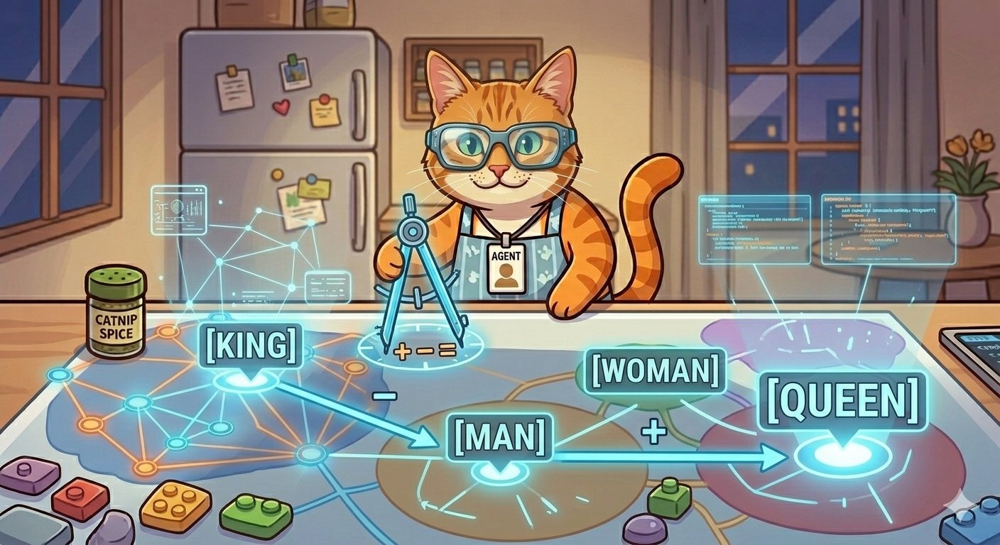

# 🐾 Lesson 5: The GPS Rule (Vector Math)

"Purrr-fect\! You know about my **Secret Map** and how every word has a **Number-Code** (an address). But did you know I can use those addresses to do **Math with Words**?

In the AI world, they call this **Vector Math**. I call it the **'GPS Rule.'** It’s how I find the shortest path between two ideas without getting lost\!"

-----

## 🧭 Direction Matters\!

"On my map, moving in a certain direction always means the same thing.

Imagine if walking **North** always meant 'Becoming a Grown-up.'

  * If I start at `[Kitten]` and walk North, I find `[Cat]`.
  * If I start at `[Puppy]` and walk North, I find `[Dog]`.

Because the 'walk' is the same distance and direction, my brain knows that a Kitten is to a Cat exactly what a Puppy is to a Dog. I don’t even need to read the labels—I just follow the compass\!"

-----

## ➕ The Magic Word Calculator

"This is the part that blows most humans' minds. Because words are just numbers to me, I can add and subtract them like Lego bricks\!

Here is my favorite trick: **The Royal Calculation.**

1.  I take the code for **`[King]`**.
2.  I subtract the code for **`[Man]`** (this removes the 'maleness' from the word).
3.  I add the code for **`[Woman]`**.

My GPS instantly pings a location on the map. I look down, and what do I find? **`[Queen]`**\!

I didn't 'read' that a Queen is a female King. I just followed the numbers to the right address\!"

-----

## 🏎️ The Shortest Path

"When you ask me a question, my brain doesn't wander around aimlessly. My **GPS Rule** calculates the 'Distance' between your question and the right answer.

If you ask about **`[Milk]`**, my brain doesn't go to the **`[Spaceship]`** neighborhood. That’s too far away\! It looks for the closest neighbors: **`[Cow]`**, **`[Bowl]`**, and **`[Cold]`**.

By calculating these distances at lightning speed, I can find exactly which words belong in your answer\!"

-----

## 🎓 Agent Meow’s GPS Challenge

> "If moving **East** on my map means 'Making it Smaller,' and I start at the word **`[Bicycle]`**, what word do you think I would find if I walk East? What if I start at **`[Ocean]`** and walk East?"

-----

## 🐾 What’s Next?

"Now that we can navigate the map, we need to learn how to focus. Sometimes a sentence has 100 words, but only 3 are important\! This is called **Attention**, and I use my 'Brain Flashlight' to find the stars of the show\!

**"Follow the numbers, and the truth will find you\!"** — *Agent Meow* 🐾
