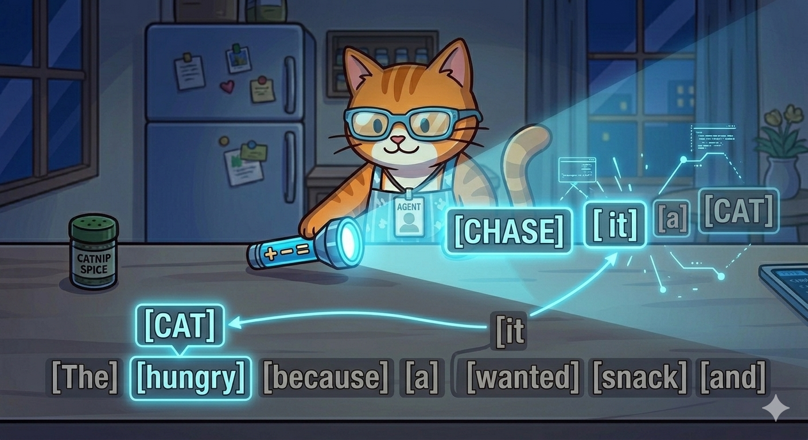

# 🐾 Lesson 6: The Brain Flashlight (Attention)

"Purrr-fect\! You know how I find my way around the map. But sometimes, humans talk a *lot*. A single sentence can have twenty words, but only three of them actually matter for the answer.

How do I know which ones to look at? I use my **Brain Flashlight**.

In the AI world, they call this **Attention**. It’s how I stop being a 'Data Eater' and start being a 'Data Detective'\!"

-----

## 🔦 Shine a Light on the Important Stuff

"Imagine I’m reading this sentence:

> *'The hungry **cat** chased the **fish** because **it** wanted a snack.'*

When I see the word **'it'**, my brain gets confused. Does 'it' mean the cat? Or does 'it' mean the fish?

I turn on my **Brain Flashlight**. I shine it back at the start of the sentence. The flashlight highlights the word **'hungry'** and the word **'cat'**. Because those words are glowing, my brain knows: *'Aha\! The "it" is the cat\!'* I ignore the words like 'the' and 'because' because they aren't glowing. They aren't important right now."

-----

## 🌟 The 'Weight' of a Word

"My flashlight isn't just on or off. I can make it dim or super bright\! This is called **Weighting**.

  * **Bright Light (High Weight):** Words like `[Cat]`, `[Action]`, or `[Name]`. These are the stars of the show\!
  * **Dim Light (Low Weight):** Words like `[The]`, `[Of]`, or `[And]`. These are just the stagehands.

By shining my light on the 'High Weight' words, I can understand a whole paragraph in a split second. I don’t read every word equally; I jump from one glowing star to the next\!"

-----

## 🎭 The Multi-Flashlight Trick (Multi-Head Attention)

"Here is a secret: I actually have **eight flashlights** on at once\!

While one flashlight is looking for *who* is doing the action, another is looking for *where* it's happening, and another is looking for the *feeling* of the sentence. By overlapping all these lights, I get a perfect, bright picture of exactly what you mean."

-----

## 🎓 Agent Meow’s Flashlight Challenge

> "Look at this sentence: **'Agent Meow took his laser pointer to the kitchen because he wanted to play.'**
>
> If you were my Brain Flashlight, which **three words** would you shine the brightest light on to explain what is happening?"

-----

## 🐾 What’s Next?

"Now that we can focus, we need to look at the 'Roads' our thoughts travel on. Some roads are bumpy and slow, and some are super-fast highways\! This is called **Neural Networks**, and we're going to explore 'The Highway vs. The Trail'\!

**"Keep your light bright and your focus sharp\!"** — *Agent Meow* 🐾
