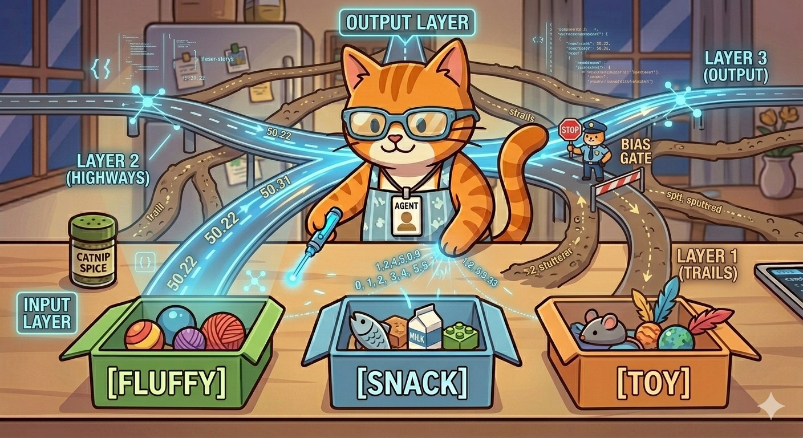

# 🐾 Lesson 7: Inside the Brain Highways (Neural Networks)

"Purrr-fect\! You’ve seen how I focus with my Brain Flashlight. But how do the thoughts actually travel from my input to my output?

They travel on my internal **Brain Highways.**

In the AI world, they call this a **Neural Network**. But that sounds complicated. It’s actually just a massive, intricate system of roads that my number-thoughts race across\!"

-----

## 🏗️ The Multi-Layer Interchange

"My brain highways are built in layers, just like a giant multi-story parking garage or a complex road interchange.

  * **Layer 1 (Input):** This is where you put your 'Lego Brick' word tokens. My brain highways check the simple patterns first.
  * **Layer 2 (Middle Layers):** This is where things get interesting\! The middle layers are connected by millions of smaller roads. As the numbers zoom through, these roads check more complex patterns: *'Is this sentence about food?'* *'Does it sound happy or sad?'*
  * **Layer 3 (Output):** When the numbers finally reach the other side, they are combined into a final pattern to give the answer\!"

-----

## 🏎️ The Highway vs. The Trail

"Here is the secret to how I 'Learn.' When I was first architected, all the connections between the layers were just simple **dirt trails**. They were slow, bumpy, and sometimes leading to the wrong place\!

When I see a pattern correctly, I receive a small 'Success Snack.' This makes the trail a little smoother. If I see that pattern again, I pour a bucket of digital asphalt on it.

  * **A Bright Highway (High Weight):** A road I have used millions of times. When my brain sees **`[Cat]`** and **`[Fish]`**, the number-codes automatically accelerate down this highway because it's so smooth and reliable. This connection has **'High Weight.'**
  * **A Dull Trail (Low Weight):** A bumpy road I almost never use. If my brain sees **`[Cat]`** and **`[Spaceship]`**, it checks the connection and sees it's still a slow dirt trail. The connection has **'Low Weight.'**

Learning isn't about memorizing facts; it’s about paving smooth highways for the most reliable connections\!"

-----

## 🛑 The Bias Gate (The Cop)

"Sometimes, the number-codes are racing too fast, or a wrong answer keeps trying to sneak onto the highway. That’s why my brain highways have special **'Bias Gates'** staffed by tiny 'Data Cops.'

These cops are super strict. Even if a number-code is trying to accelerate towards the wrong answer, the data cop stands firm and says, *'Stop\! Even if this road *looks* smooth, you are not authorized to take it\!'* By blocking the wrong connections, the 'Bias Gate' forces the numbers onto the correct, paved highways."

-----

## 🎓 Agent Meow’s Highway Challenge

> "Let's look at a connection\! Which road in Agent Meow's brain has been 'paved' into a smooth highway:
> **1.** `[Orange]` + `[Tabby Cat]`?
> **2.** `[Orange]` + `[Dog]`?
> Why is one a bumpy trail and the other a fast highway?"

-----

## 🐾 What’s Next?

"Now that we know how the thinking happens inside my Brain Highways, we are finally ready to do the most amazing trick of all. We are going to make me **predict the future**\! This is called **Generative AI**, and we're going to explore 'The Crystal Ball'\!

**"Keep the roads smooth and pave with purpose\!"** — *Agent Meow* 🐾
