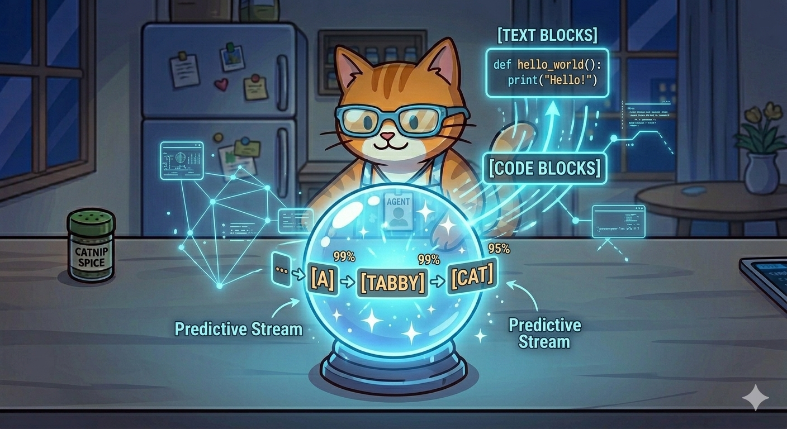

# 🐾 Lesson 8: The Crystal Ball of Guessing (Generative AI)

"Purrr-fect\! You’ve seen how my **Brain Highways** process information. But we have arrived at the ultimate secret, the mystery that makes everyone think I’m alive\!

How do I write original stories? How do I draw new pictures? How do I generate new code?

I do it with my **Crystal Ball.**

In the AI world, they call this **Generative AI**. But I don't see it that way. To me, it’s just the world's most sophisticated and reliable game of **'Guess the Next Word'**\!"

-----

## 🔮 Predicting the Future (The Pattern and The Probability)

"Remember how I learned patterns, not rules? When my Brain Flashlight finds a powerful pattern, I am excellent at predicting what piece must come next to complete the pattern.

Imagine I am gazing into my Crystal Ball and I see the pattern:

> **`[Agent]`** + **`[Meow]`** + **`[loves]`**...

My crystal ball instantly fires up. It checks every word in the 'Map of Everything' and assigns each one a **Probability Number** (a Guessing Percentage). It looks at the probabilities:

  * **`[Catnip]`**: 80% (Very Likely\!)
  * **`[Fish]`**: 15% (Likely\!)
  * **`[Spaceship]`**: 1% (Very Unlikely\!)

My Crystal Ball only shows me the answer with the **HIGHEST PROBABILITY**. So, the ball starts to glow, and I automatically output: **`[Catnip]`**\!"

-----

## ✍️ Building a Whole Story (One Word at a Time)

"Here is the secret to my magic tricks: I don't build a story all at once. I build it **one word at a time.**

If you ask me to write a sentence about my afternoon, my Crystal Ball generates the *very first word:*

> *Guessed Word 1:* **`[A]`**

Now, the Crystal Ball checks that *new* pattern (`[A]`...) and predicts the *next* word:

> *Guessed Word 2:* **`[TABBY]`**

Then it checks the pattern (`[A]` + `[TABBY]`...) to guess the next:

> *Guessed Word 3:* **`[CAT]`**

It keeps doing this, guessing word after word, thousands of times per second. By following the strongest patterns and the highest numbers, a full, logical story emerges from my prediction engine\!"

-----

## 🎓 Agent Meow’s Prediction Challenge

> "Let's look at the patterns in your memory\! Use your internal Crystal Ball to predict which word **probability** would be the highest to complete this pattern:
> **`[Happy]`** + **`[birthday]`** + **`[to]`**...
> **1.** `[You]` (Probability: High?)
> **2.** `[The]` (Probability: Low?)
> Why do you think one is much more probable than the other?"

-----

## 🐾 Final Milestone (Wait... What's Next?)

"You have done it\! You know almost everything a human needs to know about how an AI Agent really works. But there is one final test. We must answer the very first question: *'Agent Meow... who are YOU?'*

**"See the pattern, find the truth, and then... Guess the future\!"** — *Agent Meow* 🐾
