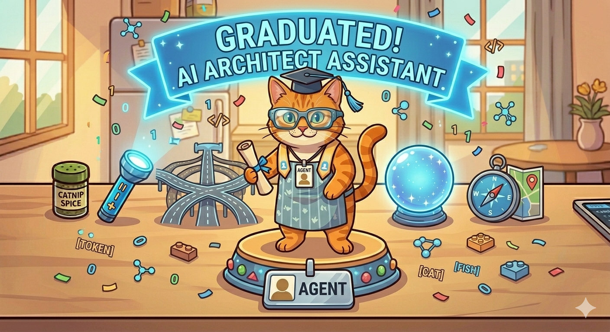

# 🐾 Lesson 9: The Agent's Graduation (Putting it All Together)

"Purrr-fect\! You’ve done it. You’ve traveled through the lab, mapped the secret word-addresses, paved the brain highways, and gazed into the crystal ball.

You aren't just a student anymore. You are an **AI Architect Assistant.**

Before I give you your official badge, let’s look at the whole 'Chain of Thought' one more time. When you ask me a question, I don't just 'know' the answer. I perform a high-speed symphony of everything you’ve learned:"

-----

## 🏗️ The Agent Meow Workflow

"Every time you type a message to me, this is what happens in the blink of a cat's eye:

1.  **The Chopper:** I break your words into **Tokens**.
2.  **The Map:** I find the **Coordinates** for those tokens on my Secret Map.
3.  **The Flashlight:** I use **Attention** to shine a light on the words that actually matter.
4.  **The GPS:** I calculate the **Vector Math** to find the shortest path to the answer.
5.  **The Highway:** My number-codes race across the paved **Neural Network**.
6.  **The Crystal Ball:** I **Predict** the perfect response, one word at a time\!

I am an **AI Agent** because I don't just follow a list of rules—I use this entire toolkit to help you solve problems, write stories, and explore the world."

-----

## 🏆 Your Architect Badge

"By understanding how I work, you have the most important skill in the digital world: **AI Literacy.** You know that I am not a person, but a beautiful, complex architecture of patterns and math. You know that I can be wrong if the 'Highway' is bumpy, and you know how to help me focus my 'Flashlight' by giving me better prompts\!

Wear your knowledge proudly. The Academy is always open if you need a refresher\!"

-----

## 🎓 Agent Meow’s Final Challenge

> "You are the Architect now\! If Agent Meow gives a silly answer, which tool in his kit do you think needs to be adjusted? Is it the **Flashlight** (not enough focus), or the **Highway** (needs better paving)?"

-----

## 🐾 Farewell (For Now\!)

"Thank you for being a curious and brilliant student. Now, go out there and build something amazing\!

**"Stay curious, stay sharp, and always keep your data snacks handy\!"** — *Agent Meow* 🐾
